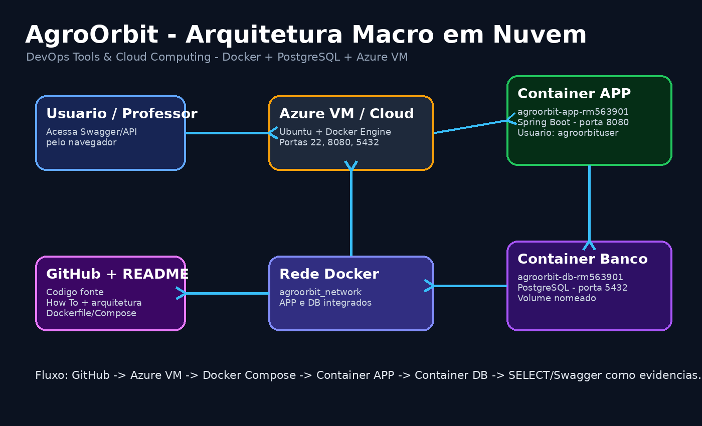
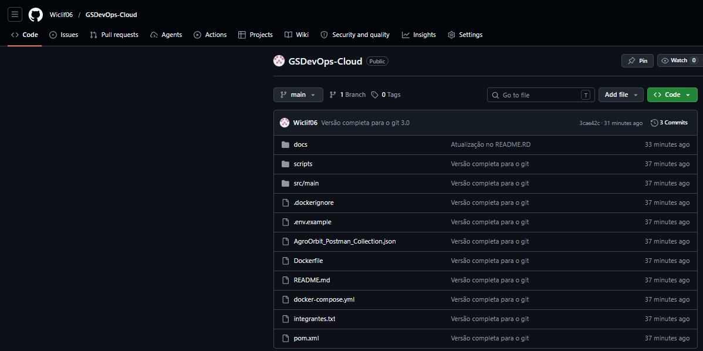
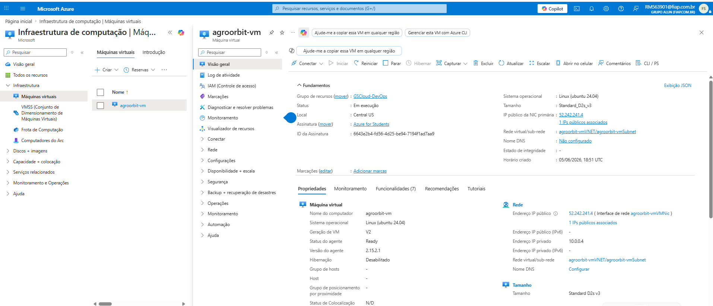
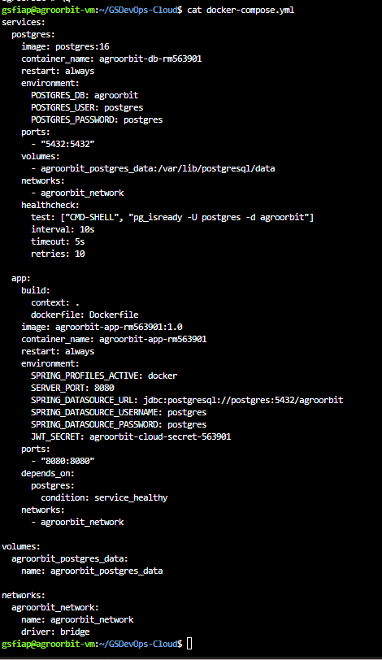
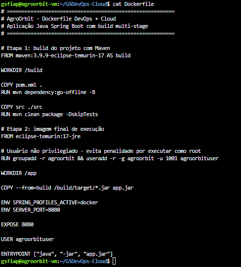
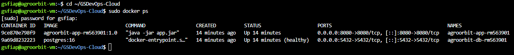
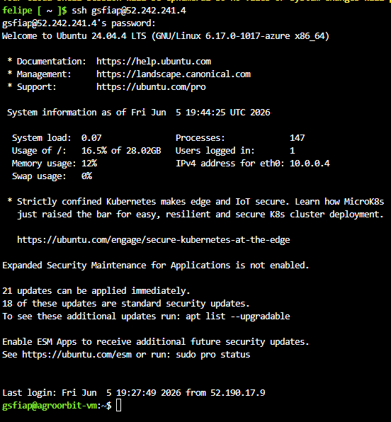
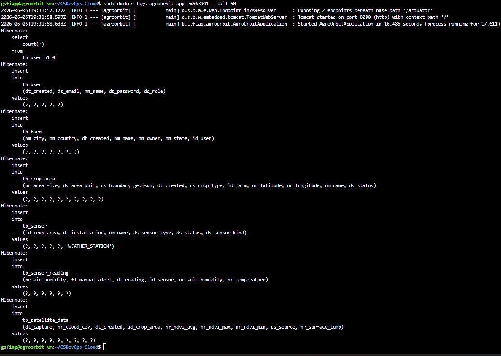
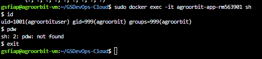
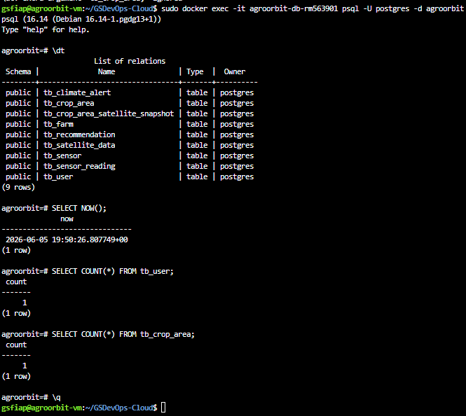

# AgroOrbit - DevOps Tools & Cloud Computing

## Integrantes

| Nome | RM |
|------|------|
| Lucas Gonçalves Viana | 563254 |
| Deryk de Souza Queiroz | 563412 |
| Vinicius Paschoeto da Silva | 563089 |
| Felipe Wiclif Leal da Silva | 563901 |

## Descrição da solução

A AgroOrbit é uma solução de monitoramento agrícola conectada ao tema da Global Solution 2026/1: Economia Espacial.  
A aplicação utiliza dados de sensores, indicadores climáticos e dados satelitais para apoiar produtores rurais na tomada de decisão.

Nesta entrega de **DevOps Tools & Cloud Computing**, a API Java Spring Boot da AgroOrbit foi conteinerizada com Docker e integrada a um banco PostgreSQL em container separado.

## Arquitetura macro da solução



## Tecnologias utilizadas

- Java 17
- Spring Boot
- Maven
- PostgreSQL
- Docker
- Docker Compose
- Swagger/OpenAPI
- Azure VM / Linux Ubuntu para execução em nuvem

## Containers

| Container | Função | Porta | Observação |
|---|---|---:|---|
| `agroorbit-app-rm563901` | API Java Spring Boot | 8080 | Imagem personalizada via Dockerfile |
| `agroorbit-db-rm563901` | Banco PostgreSQL | 5432 | Imagem pública PostgreSQL 16 |

### Logs da aplicação

```bash
docker logs agroorbit-app-rm563901
```

### Logs do banco

```bash
docker logs agroorbit-db-rm563901
```

### Acessar container da aplicação

```bash
docker exec -it agroorbit-app-rm563901 sh
pwd
ls -l
whoami
exit
```

### Acessar container do banco

```bash
docker exec -it agroorbit-db-rm563901 psql -U postgres -d agroorbit
```

Dentro do PostgreSQL:

```sql
\dt
SELECT * FROM tb_user;
SELECT * FROM tb_farm;
SELECT * FROM tb_crop_area;
SELECT * FROM tb_sensor;
SELECT * FROM tb_satellite_data;
SELECT * FROM tb_climate_alert;
\q
```

Se algum nome de tabela estiver diferente, rode `\dt` e use o nome exato retornado pelo banco.

## Como parar

```bash
docker compose down
```

Parar e apagar volume:

```bash
docker compose down -v
```

## GIT HUB

```text
https://github.com/Wiclif06/GSDevOps-Cloud.git
```
## Evidência 1 - Repositório GitHub

Repositório contendo todo o código-fonte, Dockerfile, Docker Compose, documentação e estrutura do projeto.



---

## Evidência 2 - Máquina Virtual Azure

Máquina Virtual Ubuntu criada na Microsoft Azure para hospedagem da aplicação.



---

## Evidência 3 - Docker Compose

Arquivo responsável pela orquestração dos containers da aplicação e banco de dados.



---

## Evidência 4 - Dockerfile

Dockerfile utilizado para geração da imagem personalizada da aplicação Spring Boot.



---

## Evidência 5 - Containers em Execução

Comprovação dos containers da aplicação e do banco PostgreSQL executando na Azure VM.



---

## Evidência 6 - Conexão SSH com a VM

Acesso remoto realizado na máquina virtual hospedada na Azure.



---

## Evidência 7 - Logs da Aplicação

Inicialização da aplicação Spring Boot demonstrando execução correta dentro do container Docker.



---

## Evidência 8 - Usuário Não Root

Execução da aplicação utilizando usuário dedicado, seguindo boas práticas de segurança.



---

## Evidência 9 - Banco PostgreSQL

Validação do banco de dados contendo tabelas criadas automaticamente pelo Hibernate e dados persistidos.



---

## Evidência 10 - Swagger Público

Documentação OpenAPI acessível publicamente através do IP da máquina virtual Azure.

## URL

```text
http://52.242.241.4:8080/swagger-ui/index.html
```